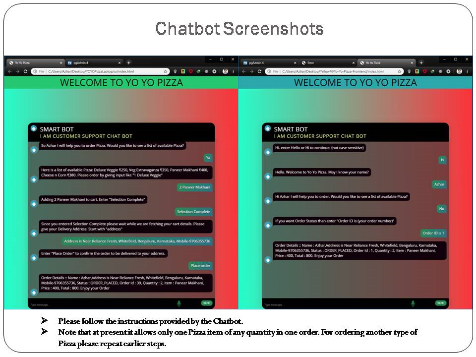

                      Yo-Yo-Pizza-Bot-Frontend
Application Features

Please follow the instructions provided by the Chatbot.
Note that at present it allows only one Pizza item of any quantity in one order. For ordering another type of Pizza please repeat earlier steps. 

The Chatbot supports the following use-cases:
 UI to chat with the chatbot
 Take user details
 Order a pizza
 Check Pizza Status by Order ID
 
App is deployed on a server, and is accessible at	http://bit.ly/YoYoPizza

Github repository for Frontend is: https://github.com/Azhar-git/Yo-Yo-Pizza-Frontend

Github repository for Backend is: https://github.com/Azhar-git/Yo-Yo-Pizza-Bot

      Development Tools:
Frontend: HTML, CSS, Jquery
Backend: Node.js
Database: Postgresql
NLP: https://dialogflow.com
Server and Database hosting: https://www.heroku.com
URL shortener: https://app.bitly.com
Repositories hosting: https://github.com
Domain provider: https://github.com

